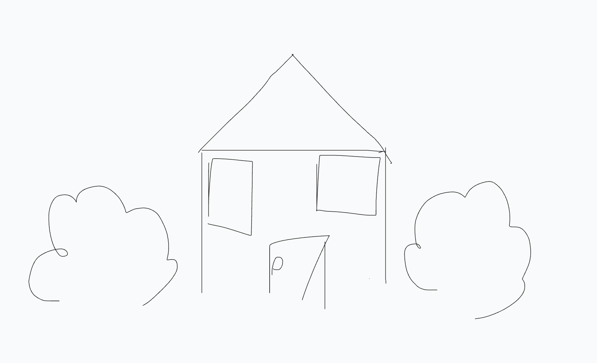
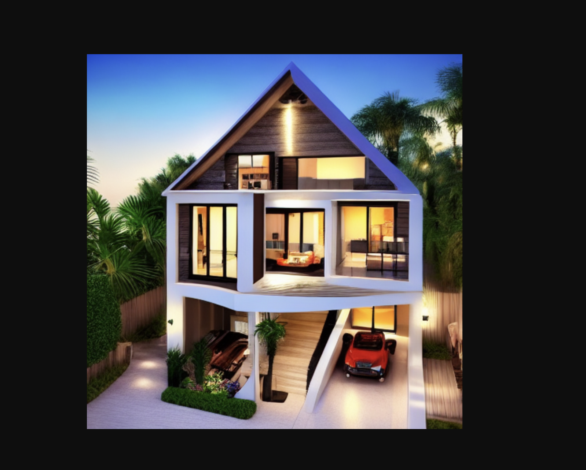

# Tldraw Editor + AI Image Generation

This project is a web-based editor built using tldraw, integrated with an AI image generation feature powered by Replicate. It allows users to draw scribbles and transform them into detailed images using AI.

## Features

*   Real-time collaborative vector editor using tldraw.
*   Automatic saving of the editor's state (debounced).
*   Manual shape modification button.
*   AI Image Generation:
    *   Convert drawings/scribbles on the canvas into detailed images using a prompt and the ControlNet Scribble model on Replicate.
    *   Input field to customize the AI generation prompt.
    *   Generated image URL opens in a new tab.
*   Server-side logic handled via tRPC for type-safe API calls.
*   UI built with Next.js (App Router), TailwindCSS, and Shadcn UI components.

## Technologies Used

*   [Next.js](https://nextjs.org/) (v15+, App Router)
*   [React](https://reactjs.org/) (v19+)
*   [tldraw](https://tldraw.dev/) (v2+)
*   [tRPC](https://trpc.io/) (v11+)
*   [TailwindCSS](https://tailwindcss.com/)
*   [Shadcn UI](https://ui.shadcn.com/)
*   [Replicate](https://replicate.com/) Node.js Client
*   [Sharp](https://sharp.pixelplumbing.com/) (for server-side SVG processing)
*   [Zod](https://zod.dev/)

## Setup and Installation


1.  **Prerequisites:**
    *   **Node.js:** Version **18.17.0 or higher** is required (due to the `sharp` library dependency). I recommend using [nvm](https://github.com/nvm-sh/nvm) to manage Node versions.
        ```bash
        # Example using nvm
        nvm install --lts
        nvm use --lts
        node -v # Verify version is v18+ or v20+
        ```
        
    *   **npm/yarn/pnpm:** A Node.js package manager.

2.  **Clone the repository:**
    ```bash
    git clone <your-repository-url>
    cd <repository-directory>
    ```

3.  **Install dependencies:**
    *   It's recommended to perform a clean install after ensuring the correct Node.js version.
    ```bash
    # Clean potential previous installs (optional but recommended if switching Node versions)
    rm -rf node_modules
    rm -f package-lock.json # or yarn.lock / pnpm-lock.yaml

    # Install dependencies
    npm install
    # or: yarn install / pnpm install
    ```
    *   *Note:* If you encounter installation errors related to `sharp` despite having the correct Node.js version, you might need system-level build tools (like `build-essential`, `python`, `vips` on Linux/macOS). Refer to the [sharp installation documentation](https://sharp.pixelplumbing.com/install).

4.  **Set up Environment Variables:**
    The AI image generation feature requires API access to Replicate.
    *   Create a `.env` file in the root of the project.
    *   Get an API token from [replicate.com/account](https://replicate.com/account).
    *   Add your token to the `.env` file:
        ```env
        REPLICATE_API_TOKEN=r8_YourReplicateApiTokenHere ( if you dont have it dont worry, let me know and i will give it to you)
        ```
    *   **Important:** Add `.env` to your `.gitignore` file to avoid committing your secret token!

## Running the Application Locally

1.  **Start the development server:**
    ```bash
    npm run dev
    ```

2.  **Open your browser:**
    Navigate to [http://localhost:3000/editor](http://localhost:3000/editor) (or the port specified in your terminal).

## How to Use

1.  **Editor:**
    *   Use the tldraw tools to draw, write, etc.
    *   Changes are automatically saved to the server's in-memory store after a short delay. Refreshing preserves the state.
    *   The "Modify Shape" button demonstrates programmatic shape updates and triggers a save.


    

2.  **AI Image Generation:**
    *   Draw a scribble or any shape(s) on the canvas.
    *   Optionally, modify the text in the input field next to the "Modify Shape" button (default prompt is "make a crazy version of that draw").
    *   Click the "Generate Scribble" button.
    *   The application will:
        *   Send your drawing (as an SVG) and the prompt to the backend.
        *   The backend converts the SVG to a PNG Data URI using `sharp`.
        *   The backend sends the PNG Data URI and prompt to the Replicate API (ControlNet Scribble model).
        *   The backend waits for Replicate to process the image.
        *   Upon success, an alert will show the generated image URL.
        *   A new browser tab will automatically open displaying the generated image.
    *   **Note:** The generated image currently opens in a new tab. It does *not* replace the drawing on the canvas due to potential browser CORS restrictions when embedding images directly from `replicate.delivery`.

    


    

## API Endpoints (tRPC)

Interaction with the backend is done via tRPC procedures called from the frontend.

*   `document.getDocument`: Retrieves the current editor state from the server's memory. Called on page load.
*   `document.saveDocument`: Saves the provided editor state to the server's memory. Called automatically on changes (debounced) or via the "Modify Shape" button.
*   `ai.generateImageFromScribble`: Takes an SVG string and a text prompt, converts the SVG to PNG, sends it to Replicate's ControlNet Scribble model, waits for completion, and returns the generated image URL. Called by the "Generate Scribble" button.

You can monitor these calls and their payloads/responses using your browser's Network tab while interacting with the application.

You can watch these API calls happen in your browser's Network tab if you're curious!

## Requirements Checklist & Code Location

This section maps the technical test requirements to the relevant parts of the codebase.

**Functional Requirements:**

1.  **Editor page:**
    *   ✅ Implemented: `src/app/editor/page.tsx`
2.  **API endpoint to retrieve store data:**
    *   ✅ Implemented: 
        *   Endpoint: `src/server/api/routers/document.ts` (`getDocument` procedure)
        *   Client Usage: `src/app/editor/page.tsx` (`api.document.getDocument.useQuery`)
3.  **Store updated after any change:**
    *   ✅ Implemented: 
        *   Detection/Save Logic: `src/app/editor/page.tsx` (`useEffect` with `editor.store.listen`, `debouncedSave`)
        *   Endpoint: `src/server/api/routers/document.ts` (`saveDocument` procedure)
    1.  **Button that modifies a shape:**
        *   ✅ Implemented: `src/app/editor/page.tsx` (`handleModifyShape` function and associated button)
4.  **Utilize Next.js API routes:**
    *   ✅ Implemented: `src/app/api/trpc/[trpc]/route.ts` (Handles all tRPC requests)
5.  **Use TailwindCSS/Shadcn:**
    *   ✅ Implemented: `tailwind.config.ts`, `globals.css`, `src/components/ui/`, `className` props in components.
6.  **Implement tRPC:**
    *   ✅ Implemented: Core setup in `src/trpc/`, server logic in `src/server/api/`, client usage in `src/app/editor/page.tsx`.

**Technical Requirements:**

*   **Create Next.js application:**
    *   ✅ Implemented: Project structure, `package.json`, `next.config.js`.
*   **Set up TailwindCSS/Shadcn:**
    *   ✅ Implemented: Config files (`tailwind.config.ts`, `postcss.config.js`), `globals.css`, `src/components/ui/`.
*   **Construct tRPC API routes (retrieve, store):**
    *   ✅ Implemented: `src/server/api/routers/document.ts` (`getDocument`, `saveDocument`). Served via `src/app/api/trpc/[trpc]/route.ts`.
*   **Use Next.js app routing:**
    *   ✅ Implemented: `src/app/editor/page.tsx` defines the `/editor` route.
*   **Implement error handling/loading states:**
    *   ✅ Implemented: `src/app/editor/page.tsx` (Using `isPending`, `error`, `onSuccess`, `onError` from `useMutation`).
*   **Write simple documentation:**
    *   ✅ Implemented: This `README.md` file.

**Bonus Points:**

*   **Implement additional features using AI:**
    *   ✅ Implemented:
        *   Backend: `src/server/api/routers/ai.ts` (`generateImageFromScribble`, SVG->PNG conversion with `sharp`, Replicate API call).
        *   Frontend: `src/app/editor/page.tsx` (UI elements, `handleGenerateImage`, mutation call, opening result in new tab).
        *   Requires `.env` file with `REPLICATE_API_TOKEN`.
*   **Good design:**
    *   ✅ Implemented: Use of Shadcn UI components and TailwindCSS for a clean interface.

**Expected Deliverables:**

*   **Repository with Next.js app:**
    *   ✅ Provided: The current codebase.
*   **README.md file:**
    *   ✅ Provided: This file.
